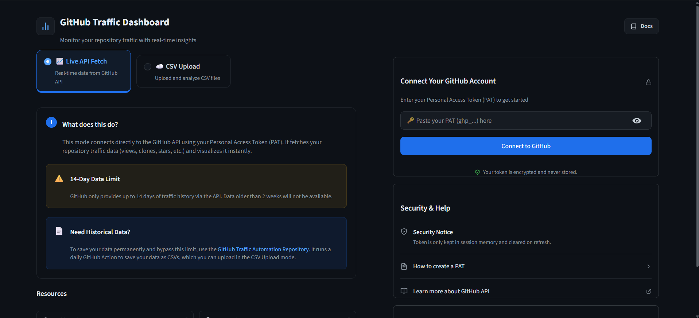

# 🚀 GitHub Traffic Dashboard



A local-only GitHub traffic analytics tool with two modes:
- **🖥️ Web UI** — Beautiful Streamlit dashboard (recommended)
- **⌨️ CLI** — Terminal output + CSV export

View 14-day views, clones, referrers, and popular paths for **all** your repositories — public and private. Everything runs on your machine. Your token never leaves your device.

[](LICENSE)
[](https://www.python.org/)
[](https://streamlit.io/)

**🔴 Try the live demo:** [git-traffic-viewer.streamlit.app](https://git-traffic-viewer.streamlit.app/)

---

## ✨ Features

| Feature | Streamlit UI | CLI |
|---|:---:|:---:|
| Token input (no hardcoding) | ✅ | ✅ |
| Summary metrics (views, clones, stars, forks) | ✅ | ✅ |
| Bar & line charts per repository | ✅ | ❌ |
| Per-repo daily views & clones chart | ✅ | ✅ |
| Top referrers & popular paths | ✅ | ✅ |
| Searchable repository list | ✅ | ❌ |
| Export to CSV | ✅ (download button) | ✅ (file) |
| Runs 100% locally | ✅ | ✅ |

---

## 🛠️ Setup (One-Time)

### 1. Clone the Repository

```bash
git clone https://github.com/yourusername/GitHub_Traffic.git
cd GitHub_Traffic
```

### 2. Create a Virtual Environment (Recommended)

**Windows:**
```bash
python -m venv venv
venv\Scripts\activate
```

**macOS / Linux:**
```bash
python3 -m venv venv
source venv/bin/activate
```

### 3. Install Dependencies

```bash
pip install -r requirements.txt
```

### 4. Generate a GitHub Personal Access Token (PAT)

1. Go to **[GitHub → Settings → Developer settings → Personal access tokens → Tokens (classic)](https://github.com/settings/tokens)**
2. Click **Generate new token (classic)**
3. Give it a name (e.g. *Traffic Dashboard*)
4. Select the **`repo`** scope — required to read traffic data for private repositories
5. Click **Generate token** and **copy it immediately**

> **🔒 Security Note:**
> 
> **If running locally:** Your token is completely safe, used only on your machine, and never sent to any external server. It is kept only in memory during your active session.
> 
> **If using a deployed web version:** Please ensure you **delete/revoke your GitHub Personal Access Token** from GitHub immediately after fetching your report. While the app does not save your token anywhere (it is cleared immediately upon refreshing or closing the tab), deleting the token from GitHub is the safest practice.

---

## 🖥️ Run: Streamlit Dashboard (Recommended)

```bash
streamlit run streamlit_app.py
```

The app opens automatically in your browser at `http://localhost:8501`.

1. Paste your GitHub token into the sidebar
2. Click **Connect to GitHub**
3. Click **Fetch Traffic Data**
4. Browse charts, explore per-repo details, and download the CSV

---

## ⌨️ Run: CLI (Terminal Mode)

The CLI reads your token from a `.env` file or an environment variable.

**Option A — `.env` file (recommended):**

```bash
# Copy the template
cp .env.example .env

# Open .env and add your token
# GITHUB_TOKEN=ghp_your_token_here
```

Then run:
```bash
python github_traffic_fetch.py
```

**Option B — pass token directly:**
```bash
python github_traffic_fetch.py --token ghp_your_token_here
```

**Option C — custom output filename:**
```bash
python github_traffic_fetch.py --output my_report.csv
```

**View all options:**
```bash
python github_traffic_fetch.py --help
```

---

## 📁 Project Structure

```
GitHub_Traffic/
├── streamlit_app.py        # 🖥️  Streamlit dashboard (self-contained)
├── github_traffic_fetch.py # ⌨️  CLI script with reusable API functions
├── requirements.txt        # Python dependencies
├── .env.example            # Token template (safe to commit)
├── .env                    # Your actual token (git-ignored!)
├── .gitignore              # Ignores .env and CSV exports
├── LICENSE                 # Apache 2.0
└── README.md               # This file
```

---

## 📊 CSV Output Columns

| Column | Description |
|---|---|
| `Repository` | Full repo name (`user/repo`) |
| `Private` | `True` / `False` |
| `Stars` | Current star count |
| `Forks` | Current fork count |
| `Total Views` | Page views in last 14 days |
| `Unique Visitors` | Unique visitors in last 14 days |
| `Total Clones` | Clone count in last 14 days |
| `Unique Cloners` | Unique cloners in last 14 days |
| `Top Referrer` | Highest-traffic referral source |
| `Top Referrer Views` | View count from top referrer |
| `Top Path` | Most visited path |
| `Top Path Views` | View count for top path |
| `Fetched At` | UTC timestamp of the fetch |

---

## ⚠️ Requirements

- **Python 3.10+**
- A GitHub account with at least one repository
- A GitHub Personal Access Token with the `repo` scope

---

## 📄 License

This project is licensed under the [Apache License 2.0](LICENSE).
